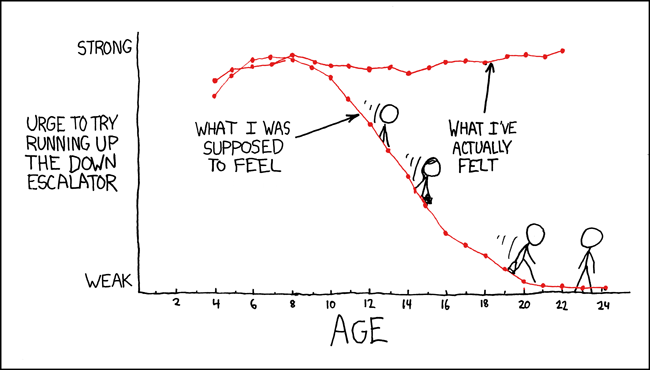

```{r}
#| label: set-up
#| include: false

library(tidyverse)
```

::: {.callout-caution}
# Optional Content

This module consists of readings reviewing material typically taught in STAT
331. It is possible you can skip over portions of this reading. It is your
responsibility to decide which areas you need to review before diving into
Stat 541.

Answer the following questions to see if you can safely skip this section. 

1. Identify the elements of the following plot as

::: columns
::: {.column width="25%"}
(i) An aesthetic
(ii) A geometry
(iii) A scale
(iv) None of the above
:::

::: {.column width="5%"}
:::

::: {.column width="70%"}

:::
:::

(a) The x-axis is age
(b) The y-axis is "Urge to run up the down escalator"
(c) The y-axis ranges from "Weak" to "Strong"
(d) This is a line graph
(e) The two lines are "What I was supposed to feel" and "What I've actually felt"
(f) The lines are labeled with text
(g) Only even ages are labelled
(h) Stick figure people are sliding down the line


2. Fill in the six (6) blanks to make the plot below:

```{r}
#| eval: false
#| echo: true
#| warning: false
#| label: ggplot-plot-code

starwars %>%
  ____(species == "Human") %>%
  ggplot(mapping = aes(____ = height, y = mass, ____ = gender)) + 
  geom_[____](____ = 17, size = 3) +
  ____(x = "Height (cm)", 
       y = "Mass (kg)", 
       color = "Gender Expression"
       )
```

```{r}
#| echo: false
#| warning: false
#| label: ggplot-plot

starwars %>%
  filter(species == "Human") %>%
  ggplot(mapping = aes(x = height, y = mass, color = gender)) + 
  geom_point(pch = 17, size = 3) +
  labs(x = "Height (cm)", 
       y = "Mass (kg)", 
       color = "Gender Expression"
       )
```
:::

# The Grammar of Graphics

If you had a hard time answering Question 1, I would recommend reviewing
this content. You should feel comfortable with:

-   Knowing what goes into an aesthetic (`aes()`) versus the geometry (`geom_*()`)

-   Identifying these elements of existing plots

## 📖 Recommended Reading: [*R4DS*: Data Visualisation](https://r4ds.hadley.nz/data-visualize.html)

## 🎥 Recommended Video



# Using ggplot2

If you had a hard time answering Question 2, I would recommend reviewing
this content. You should be comfortable with:

-   Using the "big 5" geometries
    * `geom_point()`
    * `geom_bar()` / `geom_col()`
    * `geom_line()`
    * `geom_histogram()`
    * `geom_boxplot()`

-   Changing optional arguments
    * Shape of points
    * Size of points
    * Linewidth of line
    * Binwidth of histogram

-   Faceting
    * `facet_wrap()` for one categorical variable
    * `facet_grid()` for two categorical variables

## 📖 Recommended Reading -- [*R for Data Science* - Layers](https://r4ds.hadley.nz/layers.html)
