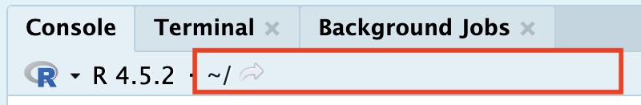

This module consists of readings reviewing material typically taught in STAT
331. It is possible you can skip over portions of this reading. It is your
responsibility to decide which areas you need to review before diving into
Stat 541.

The theme of this lesson is good management of your files and data. For this 
course, you need to know how to identify **folders** and **paths**, and create
professional looking **Quarto documents**.

Answer the following questions to see if you can safely skip this section. 

1. Which statement best describes the difference between an absolute file path and a relative file path?

a.  An absolute path works only on Windows systems, while a relative path works
on all operating systems.
b.  A relative path always begins with a drive letter or /, while an absolute
path does not.
c.  An absolute path specifies a file’s location starting from the root
directory, while a relative path specifies a location based on the current
directory.
d. An absolute path can only be used for folders, while a relative path can be
used for files.

*If you had a hard time answering these questions, I would recommend reviewing
[@sec-working-directories].*

2. Why are R projects important?

a. They automatically install all R packages needed for a project.
b. They ensure that code always runs faster by optimizing file access.
c. They set the working directory to the project folder, making file paths 
consistent and reproducible.
d. They prevent users from accidentally modifying files outside the project.

*If you had a hard time answering these questions, I would recommend reviewing
[@sec-r-projects].*

3. What are the options at the top of a Quarto document (between the `---` and
`---` symbols) called?

a.  XML
b.  YAML
c.  REML
d.  TOML

4. What symbols create an R code chunk?

a.  ```` ``` ````
b.  `{r}`
c.  ```` ```{r} ````
d.  `` `{r}` ``

5. What symbol defines a level 1 heading?

a.  `$`
b.  `_`
c.  `*`
d.  `#`

*If you had a hard time answering these questions, I would recommend reviewing
[@sec-quarto].*

## Directories, Paths, and Projects 

In `R`, there are two ways to set up your file path and file system organization:

1.  Set your working directory in `R` (do not recommend)
2.  Use RProjects (preferred!)

### Working Directories in `R` {#sec-working-directories}

There are a few ways to find where your working directory is in `R`. You can
look at the top of your console (seen below) or type `getwd()` into your
console.

{fig-alt="A screenshot of the Console at the bottom of the left hand pane in RStudio. There is a red box outlining the current working directory for R, which is the location where R will look for files. In the highlighted image, the working directory starts at the 'Home' directory for a Mac which is equivalent to the C Drive for Windows."}

```{r}
#| eval: false
getwd()
```

Although it is not recommended, you can set your working directory in `R` with `setwd()`.

```{r}
#| eval: false
setwd("/path/to/my/assignment/folder")
```

### R Projects {#sec-r-projects}

📖 [Recommended Reading: Workflow and Projects](https://r4ds.had.co.nz/workflow-projects.html)

Since there are often many files necessary for a project (e.g. data sources, 
images, etc.), `R` has a nice built in system for setting up your project 
organization with R Projects. You can either create a new folder on your 
computer containing an R Project (e.g., you have not yet created a folder for
this class) or you can add an R Project to an existing folder on your computer
(e.g., you have already created a folder for this class).

::: callout-caution
# Your folder cannot synch with anything online!

Your STAT 331 folder **cannot** be in a folder stored on OneDrive or iCloud! 
Storing your folder in this location will cause your code to periodically not
run and I cannot help you fix it.
:::


::: panel-tabset
## Create with a new folder

To create a R Project in a new folder (i.e., you haven't already made a 
`stat-541` folder), first open RStudio on your computer and click 
`File > New Project`, then:

{fig-alt="A screenshot of the popup that appears when you select to make a New Project from the RStudio file menu. The 'New Directory' option is highlighted in blue, indicating this is the option that should be selected if you have not already made a folder."}
Next, you should select the "New Project" option from the list of options. Don't
worry, we will get to make many of these other options later on in this class!

{fig-alt="A screenshot of the popup that appears when you select the New Directory option from the New Project popup wizard. The 'New Project' option is highlighted in blue, indicating this is the option that should be selected."}
Give your folder a name (it doesn't have to be stat-541). However, it is good
practice for this file folder name to not contain spaces. Then, browse on your 
computer for a location to save this folder to. For example, mine is saved in my
Documents. Make sure you know how to find this; it should NOT be saved in your
Downloads!

{fig-alt="A screenshot of the popup that appears when you select the 'New Project' option from the New Project popup wizard. Directory name line displays the name of the folder that will be created, in this case stat-541. Below that line, the 'Create project as a subdirectory of' line indicates where on the computer the folder should live. In this case the folder is located in the Documents folder of the Mac. he 'Browse...' button on the right hand side allows the user to click on it and navigate to the location of the existing folder."}

Once you have completed this process, you should see a new `stat-541` folder
in your Documents folder (or wherever you save it to) and the folder should 
contain a `stat-541.Rproj` file. This is your new "home" base for this \class - whenever you refer to a file with a relative path it will begin to look for it here.

## Add to Existing Folder

To add a R Project to an existing folder on your computer (e.g., you already 
created a folder for this class), first open RStudio on your computer and click
`File > New Project`, then:

{fig-alt="A screenshot of the popup that appears when you select to make a New Project from the RStudio file menu. The 'Existing Directory' option is highlighted in blue, indicating this is the option that should be selected if you have already made a folder."}

Then, browse on your computer to select the existing folder you wish to add your R Project to. For example, mine is saved in my Documents and called `my-stat331`.

{fig-alt="A screenshot of the popup that appears when you select the Existing Directory option from the New Project popup wizard. There is a printed file path that says '~/Documents/stat-541' indicating that the project should be included in the stat-541 folder that lives in the Documents folder of this computer. The 'Browse...' button on the right hand side allows the user to click on it and navigate to the location of the existing folder."}

Your existing folder, `stat-541` should now contain a `stat-541.Rproj` file. 
This is your new "home" base for this class - whenever you refer to a file with
a relative path it will begin to look for it here.
:::

## Reproducible Documents {#sec-quarto}

Over the last ten years, science has experienced a "reproducibility" crisis. 
Meaning, a substantial portion of scientific findings were unable to be
recreated because people didn't sufficiently document the processes they used.
As such, a foundational aspect of scientific research is using tools which allow
others to reproduce your findings.

Enter Quarto---a dynamic document that allows us to interweave R code and
written text in the **same** document. Gone are the days of copying and pasting
the results of your R code into a Word document---breaking the connection
between your analysis and your report. Quarto is here to save the day!

### Downloading Quarto

The software associated with Quarto is automatically downloaded with the newest 
versions of RStudio. So, if you are using the most up to date version of RStudio
(as instructed in [Part 1 of this week's coursework](1810-review/setup-workflow.qmd)), you should already have Quarto installed on your computer. But, let's test it
out.

To ensure you have Quarto installed, carry out the following process:

-   Open RStudio
-   Click on "File" (in the upper navigation bar)
-   Select "New File" (in the dropdown options)
-   Select "Quarto Document..." (in the dropdown option)

{width="50%" fig-alt="A screenshot of the dropdown options for creating a new Quarto document. The image shows the options under the 'File' menu (in the upper option bar), the 'New File' option in the 'File' menu has been selected, opneing a popout. In the popout options, the cursor is highlighting the 'Quarto Document' option."} </br>

If you have Quarto installed, you should be prompted with the following menu:

{width="50%" fig-alt="A screenshot of the menu that should appear when you carry out the process described above. The menu is a square box with a title reading 'New Quarto Document'. On the left hand side of the box, the user can select what type of Quarto product they wish to create (Document, Presentation, or Interactive). On the right hand side, the user can control various aspects of their document, including the title, the author, the type of rendered document (HTML, PDF, or Word). At the bottom there are options to 'Create an Empty Document' (a barebones document), to 'Create' a document (with the user specified options), or 'Cancel'."}

If, instead, you receive a message saying Quarto is not installed on your 
computer, you need to download Quarto: <https://quarto.org/docs/download/>

## Introduction to Quarto

📖 [Recommended Reading: Intro to Quarto](https://r4ds.hadley.nz/quarto.html)

### HTML Documents

We will exclusively use HTML documents in this course. If you are interested in learning more about formatting options for Quarto HTML documents, I would recommend checking out:

-   [a discussion of the basics of formatting HTML documents in Quarto](https://quarto.org/docs/output-formats/html-basics.html)

-   [the list of all HTML formatting options for Quarto documents](https://quarto.org/docs/reference/formats/html.html)
