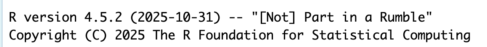
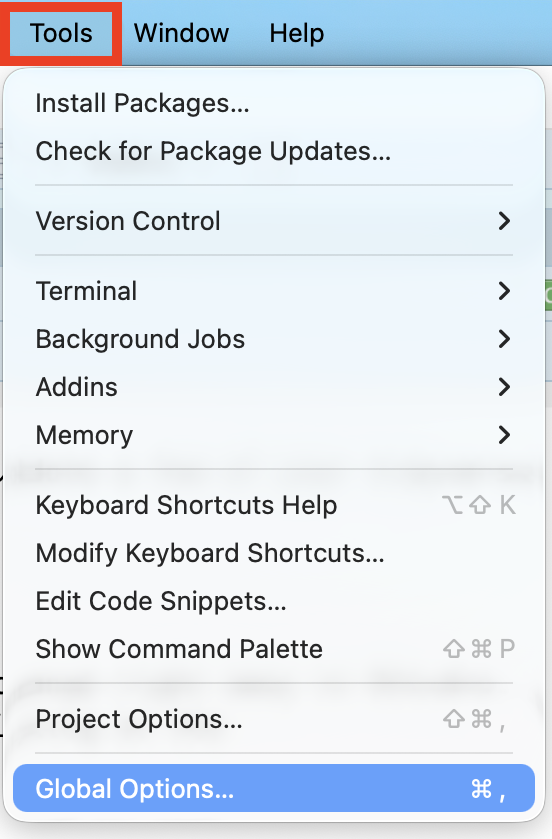
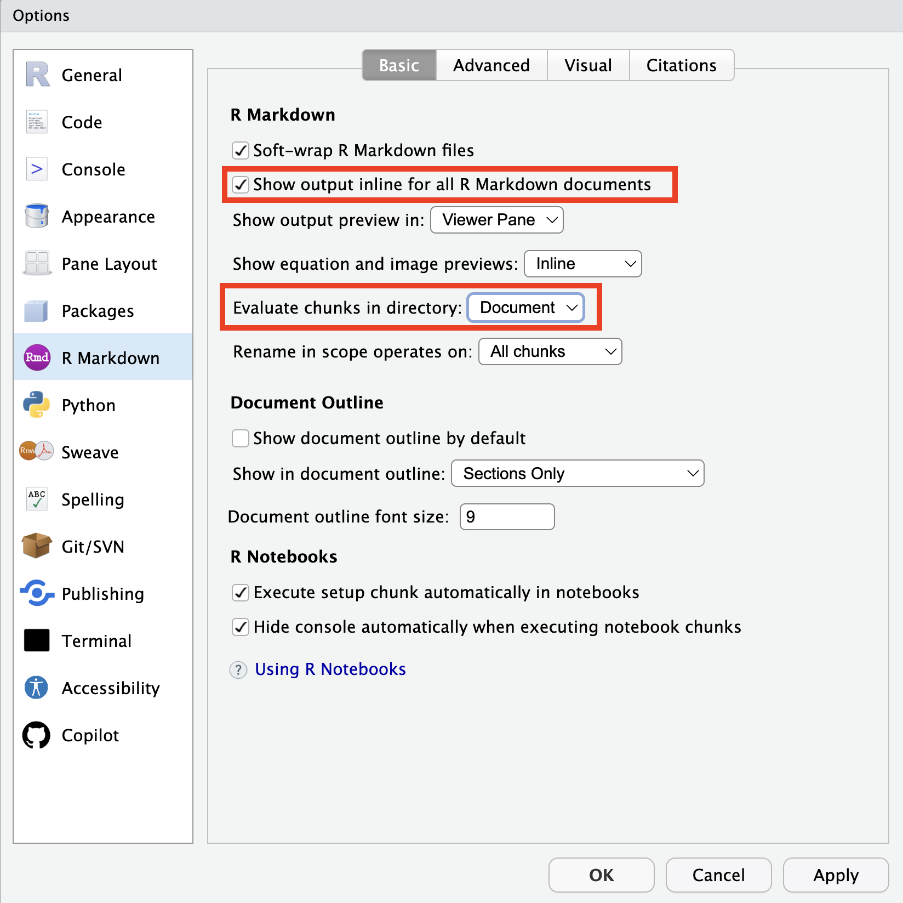

::: {.callout-important}
# Not Optional Content

As opposed to the latter sections, this section **is not optional**. Every
student is required to have completed each of the steps below to ensure you 
have the most up to date versions of R and RStudio.
:::

Your **workflow** refers to the series of good habits you get into in your
coding process, that help save you time and headache down the road.

This document outlines our suggestions for getting going with your workflow. 
None of these items is required for the course; they will simply make your life
easier down the road.

## Updating R

Each of you should have R already installed on your computer, but you might not
have the most up to date version of R! **Do not ignore these instructions.** If
you neglect to update your version of R, you may find that updating a package
will make it so your code will not run.

-   Step 1: Open RStudio
-   Step 2: At the top of the the Console it will say what version of R you are
using

{fig-alt="A screenshot of what version of R should appear when you open RStudio. The version reads 'R version 4.5.2 (2025-10-31) -- '[Not] Part in a Rumble'."}

If the version **is not** 4.5.2 (like the image above), you need to update your
version of R! The simplest way to do this is to follow the instructions below to
install R.

## Installing R

Download and install R by going to <https://cloud.r-project.org/>. Here, you
will find three options for installing R---click on the option for your
computer's operating system.

::: {.callout-required-video}
::: youtube-video-container

:::
:::

### If you are a *Windows* user:

-   Click on “Download R for Windows”

-   Click on “base”

-   Click on the Download link.

-   When you open the execution file (`.exe`) you will be prompted with a
variety of questions about installing R. Feel free to use the default features /
settings that come with R (continue to click "Ok" until the download starts).

::: callout-warning
# Multiple Versions of R

Beware that if you had a previous version of R downloaded on your PC, that old
version will not be deleted when you download the most recent version of R. We
do not want to have two versions of R installed, as your computer can get
confused what version of R to use. So, you need to remove the old version of R.

To do this you need to:

-   Navigate to your computer's settings
-   Click on the "Apps" option on the left-hand panel
-   Search for or scroll down to R
-   Find the older version of R

{fig-alt="A screenshot of a PC with two different versions of R installed---version 4.3.1 and version 4.4.1."}

-   Click on the `...` on the right side
-   Select "Uninstall"

{fig-alt="A screenshot of selecting the (...) option to uninstall the older version of R."}
:::

### If you are *macOS* user:

-   Click on “Download R for (Mac) OS X”

-   Under “Latest release:” click on R-X.X.X.pkg, where R-X.X.X is the version
number. For example, the latest version of R as of July 1, 2024 was R-4.4.1
(Race for Your Life).

-   When installing, use the default features / settings that come with R (click
Ok until the download starts).

## Updating RStudio

RStudio can be downloaded [here](https://rstudio.com/products/rstudio/download/)

The most recent version of RStudio is 2024.12.1+563. You can check if you are
using the most recent version of RStudio by:

-   Opening RStudio
-   Clicking on "Help"
-   Selecting "Check for Updates"
-   Choosing "Quit and Download" if there is an update available

## Installing / Updating the `tidyverse`

In this class, we will make heavy use of the `tidyverse` packages.

If you **have not** used the `tidyverse` before, type the following into your
console:

```{r}
#| eval: false
#| label: tidyverse-install

install.packages("tidyverse")
```

If you **have** used the `tidyverse` before, you only need to update packages.
Type the following into your console:

```{r}
#| eval: false
#| label: tidyverse-update

library(tidyverse)
tidyverse_update()
```

Then follow the instructions that print out to update a few of your tidyverse
packages.

## Configure your options

There are a few settings we recommend that you change right away in RStudio. 
These can be accessed by opening RStudio and clicking on the "Tools" option from 
the top of the RStudio menu and selecting "Global Options..." from the dropdown
menu:

{fig-alt=""}

### R Workspace

First, in the "General" pane (that first shows up), you should not save your
environment when you close RStudio. Meaning, you should uncheck the box that
says "Restore .RData into workspace at startup" and you should select "Never" 
from the dropdown menu that says "Save workspace to .RData on exit":

{fig-alt="A screenshot of the Global options screen, specifically focusing on the 'General' section of the options. There is a red arrow pointing to the box that says 'Restore .RData into workspace at startup', indicating that this box should not be checked (this option should be turned off). There is another red arrow pointing at the dropdown menu next to 'Save workspace to .RData on exit', indicating that the option should be 'Never'."}

### Code Chunk Output

Next, click on the R Markdown pane on the left hand side. This pane allows you
to choose how your Quarto documents will behave. 

First, let's decide where we want the output of our code to appear in our 
document. If you want for the output of your code (e.g., summary statistics, 
visualizations) to be shown in the document immediately below the code chunk, 
check the box that says "Show output inline for all R Markdown documents." If 
you do not check this box, your output will either be shown in the Console (for
numerical summaries) or in the Plots tab (for visualizations). 

Second, we need to decide where Quarto should look for files that we are 
referencing. Meaning, if you reference files, should Quarto look for them
relative to the *Project* or relative to your *Quarto Document* (which might
live in a subfolder or even outside the project). I would recommend choosing
"Document" here!

{fig-alt="A screenshot of the Global options screen, specifically focusing on the 'R Markdown' section of the options. There is a red box around the option for 'Show output inline for all R Markdown documents.' and the box on the left hand side is checked indicating that this option is turned on. There is a second red box around the 'Evaluate chunks in directory:' option where there is a drop down menu for where Quarto should assume the files you are referencing should be searched for. The option selected is 'Document' which means that external files should be searched for relative to the Quarto document instead of the Project."}

::: {.callout-check-in}
1. Once you have updated R, open RStudio. If you have correctly installed the
most recent version of R, version 4.5.3 should appear at the top of your Console.
Take a screenshot of the version of R displayed in your Console.

2. In RStudio, click on the Help menu and then select "Check for Updates." If
you have correct installed the most recent version of RStudio, the message
should say "You're using the newest version of RStudio." Take a screenshot of
the message that appears.
:::