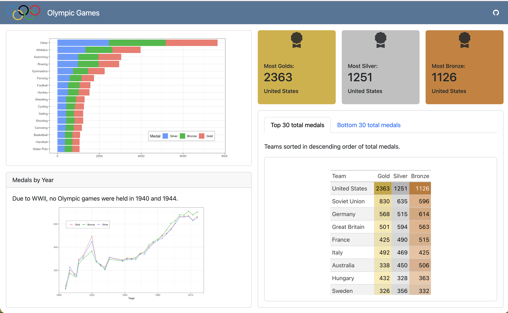

# Accessing the Practice Activity

Download the materials for the activity here: 
<a href="student/pa-5.zip" download>`pa-5.zip`</a>

This `.zip` folder contains:

1. the Quarto file for making the dashboard
2. the logo image for the dashboard
3. the data used to make the dashboard

::: {.callout-important}
Be sure to save the file inside your Week 5 folder of your STAT 431 (or 541)
folder! 
:::

# Repairing the Dashboard

The `pa-5.qmd` file you've been given creates a Quarto dashboard, but the
layout of the dashboard needs some help! Your goal for this activity is to 
transform the Quarto dashboard you've been given into [this dashboard](https://allisontheobold-intermediate-r-static-dashboard-activity.share.connect.posit.cloud):

{fig-alt=""}

## Small Incremental Changes

Rather than trying to change everything all at once, we recommend you go in 
phases. 

### Phase 1 - Layout

Change the layout of the dashboard to align with the target dashboard. Things
to consider:

- Where should the columns be?
- Where should the rows be?
- How much space should each card get (within a row or column)?

## Phase 2 - Valueboxes

Now that you have the layout set, let's adjust the valueboxes! Things you will
need to adjust:

- the color of the boxes
- the icon used for the boxes
- information included in the boxes

## Phase 3 - Visualizations

Let's turn our attention to the two visualizations. Things you will need to
adjust:

- the themes of the plots
- the location of the legends 
- the ordering of the legends
- adding a text description above the second plot

## Phase 4 - Tables

Our final step is to adjust the tables presented in the two tabsets. Things
you will need to adjust:

- how the tables are arranged
- the columns names
- the columns included
- the order of the columns

Once you are finished, submit your completed `pa-5.html` file to Canvas!