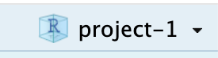
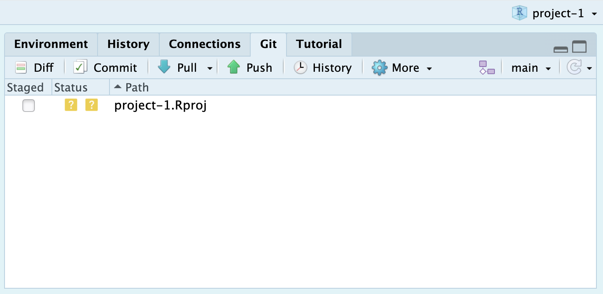
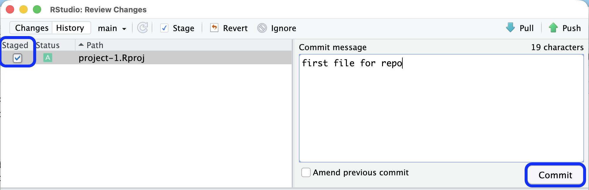
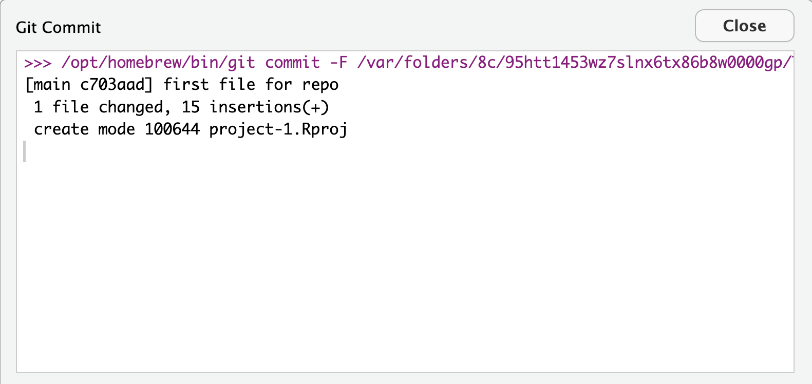
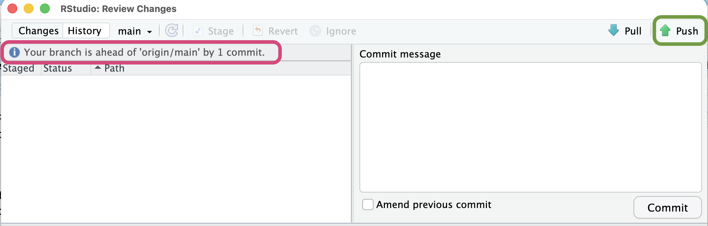
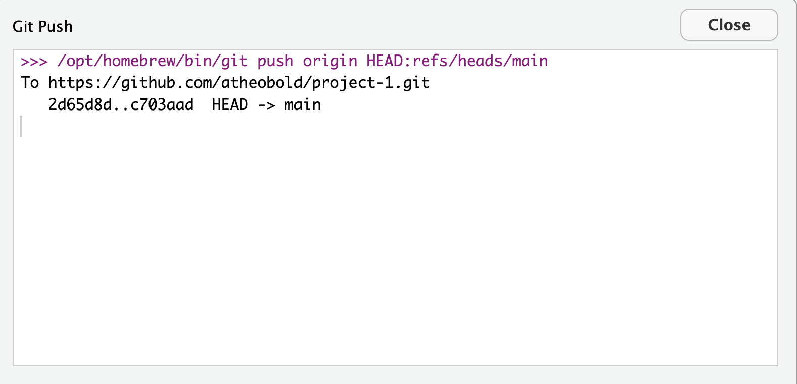

Now that you have been assigned a dataset, this week we are focused on 
acquiring the data, investigating how the data were cleaned, and working with
your group to pose research questions that could be addressed with these data.

## By the end of the week, you should have a draft report which:

-   describes the context of the data
-   explains what cleaning has been done to the data
-   poses **at least two** research questions that could be addressed with these
data 
-   poses **at least two** research questions that could be addressed using 
supplemental data 

-   sketches out two visualizations that could be made to address the 
research questions you posed above 

::: {.callout-tip}
# Making Visualization Sketches

One of our favorite tools for making sketches of data visualizations is
[Excalidraw](https://excalidraw.com/). This is a free tool!

Here is an example of a sketch we made for teaching `ggplot` in 
*Introduction to R*:

{fig-alt="A graphic displaying the relationship between a dataset (on the left) and a plot (on the right). The graphic uses colors and arrows to indicate where a column in the dataset is being mapped on the plot. The 'study_year' variable is circled in green and is being mapped to the x-axis. The 'median_wk_cost' variable is circled in red and being mapped to the y-axis. The 'county_name' variable is circled in purple and is being mapped to the color aesthetic. Finally, the visualization on the right indicates that points will be made using geom_point and lines will be made using geom_smooth."}
:::

## Submission

You will submit **both** your HTML report **and** the link to the GitHub 
repository where your report lives. In GitHub, you will need to make a new
repository where your project materials will live. 

### Create a GitHub Repository 

First, you will need to create a new GitHub repository. Here is a document
walking you through the 10 steps for accomplishing this:

<iframe src="https://scribehow.com/embed/How_To_Create_A_New_GitHub_Repository__QnOg6qOMTvWU6aRWD19-hA" width="800" height="679" allow="fullscreen" style="aspect-ratio: 1 / 1; border: 0; min-height: 480px"></iframe>

### Clone Your Repository into RStudio

Now that you have a repository, you need to clone it into RStudio so your local
changes can be pushed into your repository. Here is a document walking you 
through the 8 steps for accomplishing this:

<iframe src="https://scribehow.com/embed/Cloning_a_Repository_into_RStudio__u0yELMuBR0S5Vy8TVRpRDg" width="800" height="679" allow="fullscreen" style="aspect-ratio: 1 / 1; border: 0; min-height: 480px"></iframe>

### Push Your Changes to GitHub

Once you click "Create Project," RStudio will open your project. You will know 
the project it has open based on the blue cube that appears in the upper right
hand corner of your project ({fig-alt="A screenshot of the blue cube that can be seen in the upper right hand corner of RStudio when a project is open. The title next to the blue cube reads 'project-1', indicating the name of the project that is currently open." width=20%}). 

If you click on the "Git" tab in the upper right pane, you should see one file 
listed (`project-1.Rproj`). There is a yellow question mark next to this file
meaning it is a new file that is not currently being tracked. 

{alt-text="A screenshot of the Git pane in the upper right corner of RStudio. In this pane, there is one file listed (project-1.Rproj) and there is a yellow box with a question mark inside it, indicating that this is a file that is not currently being tracked."}

To add this file to your repository, you need to click on the "Commit" box (with
the green check mark by it). That will open a popup window like this:

{fig-alt="A screenshot of the popup window that opens when you select 'Commit' on the Git tab. On the left, the popup shows the file that is being staged, as indicated by the box that is checked next to the file name. On the right, the commit message for the file is displayed, describing the changes made to the file: 'first file for repo'. Finally, the 'Commit' button at the bottom of the commit message box is hightlighted in blue, indicating it should be clicked once the file has been stages and a message has been written."}

From here you need to first **check the box next to the file to stage it**, this 
adds it to the list of files that will be pushed to GitHub. Next, you need to 
**write a commit message in the textbox**. Once you've completed these steps, you
**click the "Commit" button** to commit these changes. 

Once you click the "Commit" button, you should see a message like this appear, 
indicating that your commit was successful. Go ahead and hit "Close" to return 
to RStudio.

{fig-alt="A screenshot of the commit message box that appears after clicking the 'Commit' button in the previous screen. The commit message box indicates if the commit was successful. The message given by git says (1) the commit ID and message ('[main c703ad] first file for repo'), (2) the number of files that were changed and how they were changed ('1 file changed, 15 insertions(+)'), and (3) that the commit was successful ('create mode 100644 project-1.Rproj')."}

Now, your Git tab should show that your branch (the local copy of your repo) is
one commit ahead of the origin (the repository on GitHub). 

{fig-alt="A screenshot of the Commit popup window after clicking 'Commit'. The popup window now shows no files but has a message above the files: 'Your branch is ahead of origin/main by 1 commit,' indicating that there are changes that were staged locally that haven't been pushed to GitHub. The upper right corner has a 'Push' button that is highlighted in green. This is the button that must be pushed to send the local changes to the remote GitHub repository."}

The final step is to push the changes to GitHub. If you click on the "Push" icon
(with the up arrow), the changes you committed will be pushed to GitHub. Similar
to the commit message, if RStudio successfully pushed the changes you will get
a message saying your changes were successfully pushed (HEAD -> main). 

{fig-alt="A screenshot of the push message box that appears after clicking the 'Push' button in the previous screen. The message box indicates (1) where the file was pushed ('To https://github.com/atheobold/project-1.git'), and (2) if it was successful ('HEAD -> main')."}

### Four Steps to Follow Every Time

You only need to setup your repository *once*, but you will need to commit and
push changes **frequently**. Our best advice is to commit and push *small*
changes (e.g., one section of a report, one visualization, one table). 

Every time you make a change to a document (new or existing), you will need to
follow these four steps:

1. Stage the file---check the box next to the file.
2. Write a commit message---describe what changes you made. 
3. Click "Commit" to log these changes. 
4. Click "Push" to send these changes up to GitHub.

