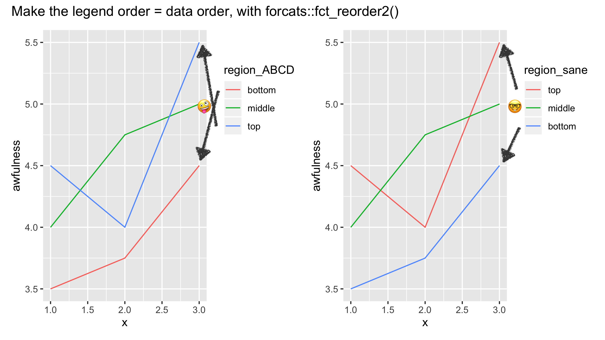

<!-- every plot needs alt text -->

```{r}
#| label: set-up

library(tidyverse)
library(palmerpenguins)
```

# Beyond the Basics of Data Visualization

Historically, there have been five plot types that are considered basic or foundational:

1.  Histograms
2.  Boxplots
3.  Barcharts
4.  Scatterplots
5.  Line graphs[^1] (or time series plots)

[^1]: We're of the opinion that line graphs are really just scatterplots with a
little extra definition, but acknowledge the first four as core plot types.

While you may have never been explicitly told these are the basic plot types, hopefully this list is not surprising to you. It's likely the case that, similar
to the normal distribution, you knew about and were using these before you even
knew their names, possibly through Excel or something back before you had taken
any statistics courses.

This week, we're going to learn about plots / geometries outside of these 
basic plots! 

## Lollipop plot with `geom_segment()`

All too often, we see people (students, researchers, newspapers) create barplots
for variables that are not counts (e.g., mean salary). A barplot is designed 
to display the **frequency** of each level of a categorical variable, so
people get confused when they are used to plot other summary statistics.

The lollipop plot solves this problem! A lollipop plot is the combination of 
**two** geometries---`geom_segment()` and `geom_point()`. The lollipop stick
is created with `geom_segment()` and each lollipop's head is created with 
`geom_point()`. 

Let's give this a look using the `penguins` data from the **palmerpenguins**
package. 

```{r}
#| label: fig-lollipop-plot

species_means <- penguins |> 
  group_by(species) |> 
  summarize(mean_flipper = mean(flipper_length_mm, na.rm = TRUE))

ggplot(data = species_means, 
       mapping = aes(x = mean_flipper, y = species)
       ) +
  geom_segment(aes(yend = species, 
                   x = 0, 
                   xend = mean_flipper), 
               color = "gray50") +
  geom_point(size = 4, color = "steelblue") +
  labs(x = "Mean Flipper Length (mm)", 
       y = "", 
       title = "Comparison of Flipper Lengths for Different Penguin Species"
       )
      
```


## Ridgeline plot with `geom_density_ridge()`

Boxplots are an easy way to assess how different the centers (medians) and 
spreads (IQR, range) are between groups. However, boxplots **do not** display 
the *shape* of a distribution. Specifically, boxplots hide distributions with
multiple modes (peaks). 

::: {.column-margin}
{fig-alt="A picture of the cover of Joy Division's Unknown Pleasures album. The album cover has a black background with a series of thin white horizontal lines stacked in the center. The lines form a jagged, wave-like pattern resembling overlapping mountain ridges or a fluctuating waveform."}
:::

The ridgeline plot solves this problem! A ridgeline plot is comprised of 
vertically stacked density plots. Because the ridgelines are stacked vertically, 
the categorical variable needs to be mapped to the y-axis. 

```{r}
#| label: fig-ridgeline-plot

library(ggridges)

ggplot(data = penguins, 
       mapping = aes(x = flipper_length_mm, 
                     y = species, 
                     fill = species)) +
  geom_density_ridges(alpha = 0.5) +
  labs(x = "Flipper Length (mm)", 
       y = "", 
       title = "Comparison of Flipper Lengths for Different Penguin Species"
       ) +
  theme(legend.position = "none")
```

::: columns
::: {.column width="35%"}
::: {.callout-tip}
# Changing the height of the ridges

If you're not a fan of the ridges touching each other, then the `scale` argument
was made just for you! If you set `scale = 1` (inside `geom_density_ridges()`)
then the top of each ridge will be the bottom of the next ridge. 
:::
:::

::: {.column width="5%"}
:::

::: {.column width="60%"}
::: {.callout-important}
# Adding color

Adding color to a plot is a fun way to make it more engaging. Here, color 
ridges are much more exciting than gray ridges. However, when we incorporate 
a `color` (or `fill`) aesthetic, ggplot2 automatically creates a legend for us. 
That's nice most of the time, but here the information from the legend (the
values of `species`) is already encoded in y-axis. So, the legend has redundant
information. We don't want to have redundant information in our plots, which 
is why we removed the legend (`theme(legend_position = “none")`). 
:::
:::
:::
## Area plot with `geom_ribbon()`

There are two types of area plots, one emphasizes the *total* area while the 
other emphasizes the area *between* two groups. The *New York Times* loves to 
use area plots, so we've pulled out two examples from the 
[What's going on in this graph collection](https://www.nytimes.com/column/whats-going-on-in-this-graph):

::: columns
::: {.column width="48%"}
**Total Area**

{fig-alt="Stacked area chart titled 'World electricity generation' showing global generation by source from 2000 to about 2022 in million gigawatt-hours. Fossil fuels (coal, gas, oil) are shown in dark blue-gray tones and clean sources (nuclear, hydroelectric and other, wind and solar) in yellow-orange tones. Coal is the largest source throughout, rising overall with a slight dip around 2020. Gas steadily increases, while oil remains relatively small and flat. Hydroelectric and nuclear grow gradually. Wind and solar expand rapidly after 2010. Total generation increases from roughly 14 million to nearly 27 million gigawatt-hours over the period."}
Notice how the area always starts at 0 and goes up to wherever the highest $y$
value is for that group.
:::

::: {.column width="4%"}
:::

::: {.column width="48%"}
**Area Between Groups**

{fig-alt="Line chart titled 'Summer temperatures in Las Vegas' showing trends from about 1950 to 2022. A red line represents average daily highs, which fluctuate around 100°F and increase slightly overall, marked as 'Daily highs +2°F.' A purple line represents overnight lows, which rise more sharply from about 70°F to around 80°F, marked as 'Overnight lows +11°F.' Shaded areas emphasize the space between highs and lows. The chart highlights that nighttime temperatures have increased much more than daytime highs over time."}
Notice how the area starts at the value of the lower group and goes up to the
value of the higher group. 
:::
:::

The **total** area plot can be made with `geom_area()` and the **between** 
area plot can be made with `geom_ribbon()`. Let's explore each of these
functions!

### Total Area

Typically, area plots are variants of line plots. So, let's use the `gapminder`
data from the **gapminder** package to explore life expectancy over time. Since
there are multiple countries for each continent (for each year), we will need 
to summarize these values before plotting[^2]

[^2]: As a reminder `geom_line()` requires there be **one** $y$ value for every
$x$ value. 

```{r}
#| label: continent-summaries
library(gapminder)

continent_life_exp <- gapminder |> 
  group_by(year, continent) |> 
  summarize(mean_life = mean(lifeExp, na.rm = TRUE), 
            .groups = "drop")

head(continent_life_exp)
```

Okay, now that we've summarized our data, let's try making an area plot!

```{r}
#| label: fig-total-area

ggplot(data = continent_life_exp, 
       mapping = aes(x = year, 
                       y = mean_life, 
                       color = continent)) +
  geom_line() +
  geom_area(mapping = aes(fill = continent), 
            position = "identity") +
  labs(x = "", 
       y = "", 
       title = "Mean Life Expectancy Over Time") 
```

Huh, that doesn't look great. It looks like we are only getting a plot for 
Oceania. We can try making the areas more transparent (with `alpha`) and see 
if we can uncover the other groups. 

```{r}
#| label: fig-area-transparent

ggplot(data = continent_life_exp, 
       mapping = aes(x = year, 
                       y = mean_life, 
                       color = continent)) +
  geom_line() +
  geom_area(mapping = aes(fill = continent), 
            position = "identity", 
            alpha = 0.25) +
  labs(x = "", 
       y = "", 
       title = "Mean Life Expectancy Over Time") 

```
Okay! We do have every area plot, it's just hard to see them. Looking at the 
plot we can tell that the tallest line is Oceania and the shortest line is 
Africa. If we do some clever reordering of the levels of `continent` then 
we should be able to see *every* group. 

::: {.callout-tip}
# Reordering Factors Based on Another Variable

In this case, we want to reorder `continent` based on the mean life expectancy. 
We could reorder this by hand, but that sounds like a lot of typing and seems 
error prone. 

Instead, we can use the `fct_reorder()` function from the
**forcats** package to reorder `continent` based on `mean_life`. We need to 
be sure to specify `.desc = TRUE` since we want the order to be larges to 
smallest!
:::

```{r}
#| label: fig-area-plot-reordered

gapminder |> 
  group_by(year, continent) |> 
  summarize(mean_life = mean(lifeExp, na.rm = TRUE), 
            .groups = "drop") |> 
  mutate(continent = forcats::fct_reorder(continent,
                                          mean_life, 
                                          .desc = TRUE)
         ) |> 
  ggplot(mapping = aes(x = year, 
                       y = mean_life, 
                       color = continent)) +
  geom_line() +
  geom_area(mapping = aes(fill = continent), 
            position = "identity", 
            alpha = 0.6) +
  labs(x = "", 
       y = "", 
       title = "Mean Life Expectancy Over Time") 
```

### Area Between Groups

Suppose instead of featuring *every* continent, we want our plot to display 
the profound differences in life expectancy between the largest and smallest 
groups. This is what a ribbon plot accomplishes!

If you look at the documentation for `geom_ribbon()` you will see that the
function requires `ymin` and `ymax` aesthetics. These values tell `ggplot()`
where the shading should start and end. Currently, the data we are plotting
have one column for `continent` and one column for `mean_life`, but we need 
to have our data structured in such a way that the values for Africa are in 
one column (for `ymin`) and the values for Oceania are in a different column
(for `ymax`). So, we are going to need to restructure our date. 

```{r}
#| label: ribbon-pivot

ribbon_summaries <- gapminder |> 
  filter(continent %in% c("Oceania", "Africa")) |> 
  group_by(year, continent) |> 
  summarize(mean_life = mean(lifeExp, na.rm = TRUE), 
            .groups = "drop") |>
  pivot_wider(names_from = continent, 
              values_from = mean_life, 
              names_prefix = "mean_")

head(ribbon_summaries)
```

Now that I've pivoted the summary statistics, I have exactly the data I need! 
The `mean_Africa` column can be mapped to `ymin` and the `mean_Oceania` 
column can be mapped to `ymax`. Let's give it a try!

```{r}
#| label: fig-geom-ribbon

gapminder |> 
  filter(continent %in% c("Oceania", "Africa")) |> 
  group_by(year, continent) |> 
  summarize(mean_life = mean(lifeExp, na.rm = TRUE), 
            .groups = "drop") |> 
  ggplot(mapping = aes(x = year, 
                       y = mean_life, 
                       color = continent)) +
  geom_line(linewidth = 2) +
  geom_ribbon(data = ribbon_summaries, 
              mapping = aes(x = year, 
                            ymin = mean_Africa, 
                            ymax = mean_Oceania
                            ), 
            position = "identity",
            inherit.aes = FALSE, 
            fill = "lightgray") +
  labs(x = "", 
       y = "", 
       title = "Profound Differences in Life Expectancy", 
       subtitle = "Comparing Continents with Highest and Lowest Life Expectancy") 
```

Voila! We have a ribbon plot highlighting the differences in life expectancy
between these two continents. The icing on the cake would be to reorder our 
legend so it goes in the same order as the plot or even remove the 
legend in favor of annotations, which we will learn in @sec-legend. 

## Heatmap with `geom_tile()`

Heatmaps are a visualization which use color intensity to represent the
magnitude of values in a dataset. With a heatmap, we can identify patterns
quickly, spot trends and anomalies, understand relationships between variables, 
and compare large amounts of data efficiently.

A simple heatmap could help us spot trends in data collection. Based on the 
heatmap below, it appears that far more penguins were sampled on the Biscoe
Island and the data collection in the first year (2007) was much smaller than
the later years. 

```{r}
#| label: fig-sample-heatmap

penguins |> 
  count(year, island) |> 
  ggplot(mapping = aes(x = year, y = island, fill = n)) +
  geom_tile() +
  labs(x = "", 
       y = "", 
       fill = "Penguins \nSampled", 
       title = "Number of Penguins Sampled Each Year", 
       subtitle = "Separated by Island of the Palmer Archipeligo")
```

Another common application of a heatmap is to visualize relationships
(correlations) between variables. The first step is to get the pairwise 
correlations. We like the **corrr** package for this, since it is compatible
with the **tidyverse** and it return a dataframe.  

```{r}
#| label: correlation-matrix

library(corrr)

penguins_cor <- penguins |>
  # Make year a category since we don't want to include it
  mutate(year = forcats::as_factor(year)) |> 
  select(where(is.numeric)) |> 
  correlate(method = "pearson", 
            use = "pairwise.complete.obs")

penguins_cor
```

The only thing different about this output (as compared to the base R `cor()`
function) is that the diagonal entries have correlations of `NA` instead of 1. 
Similar to making the area plots between groups, we should notice that these
data are not currently in the layout `ggplot()` expects. Namely, the values of 
the second variable are spread across the columns. So, we will need to pivot 
our data before we plot. 

```{r}
#| label: pivot-correlation-df

penguins_cor <- penguins_cor |> 
  rename(term1 = term) |> 
  pivot_longer(cols = -term1, 
               names_to = "term2", 
               values_to = "correlation")

penguins_cor
```

Okay, now that the data are in the correct orientation to plot, we want to 
think about the appearance of the plot. If we were to make a heatmap with these
data, the `x` and `y` values would have the current labels of `term1` and 
`term2` (e.g., `"bill_length_mm"`, `"body_mass_g"`). These don't see like the 
labels we want for a nice looking visual!

Let's first make a function to reformat the labels. The function should remove
the units and the `_` from the variable names, and convert the variable names
to titles (i.e., `Bill Length` not `bill length`). 

```{r}
#| label: title-helper-function

make_titles <- function(x){
  # remove the units at the end of the name
  str_remove(x, pattern = "(g|mm)$") |> 
  # replace all _ with spaces
  str_replace_all(pattern = "_", replacement = " ") |> 
  # remove extra whitespace on left 
  str_trim(side = "both") |> 
  # convert the first letter of each word to upper case
  str_to_title()
}
```

Okay, now let's use this function to make nice labels and get our heatmap!

```{r}
#| label: fig-correlation-plot

penguins_cor |> 
  mutate(
    across(.cols = c(term1, term2), 
           .fns = ~ make_titles(.x)
           )
    ) |> 
  ggplot(mapping = aes(x = term1,
                       y = term2, 
                       fill = correlation)) +
  geom_tile() +
  labs(x = "", 
       y = "", 
       title = "Correlation Between Penguin Body Measurements", 
       fill = "Correlation"
       )
```

## Hexbin plot with `geom_hex()`

A scatterplot is our classic visualization to investigate the relationship 
between two quantitative variables. However, the usefulness of a scatterplot
decreases as the size of the dataset grows. For example, the `diamond` dataset
has `r nrow(diamonds)` observations on the size, cut, and price of various
diamonds. When making a scatterplot of these observations, we end up with a
plot that leaves something to be desired. 

```{r}
#| label: fig-diamonds-scatter-busy

ggplot(data = diamonds, 
       mapping = aes(x = carat, 
                     y = price)
       ) +
  geom_point()
```
You may have learned about using transparency (`alpha`) or point size 
(`shape = "."`) as methods to address this issue. Another option is to create
a hexbin plot!

The **hexbin** R package contains binning and plotting functions for hexagonal
bins. The `geom_hex()` function from this package is the tool we need to 
make a hexagonal bin plot. 

```{r}
#| label: fig-hexbin

library(hexbin)

ggplot(data = diamonds) +
  geom_hex(mapping = aes(x = carat, y = price)) +
  scale_y_continuous(
    labels = scales::label_currency(prefix = "$")
    ) +
  labs(x = "Carat of Diamond", 
       y = "", 
       fill = "Number of \nDiamonds",
       title = "Number of Diamonds Observed", 
       subtitle = "For each Price, Carat Combination")
```

## But wait, there's more! 

We've only begun to scratch the surface of "non-standard" geometries that 
could be used. [The *From Data to Viz* website](https://www.data-to-viz.com/)
provides a more exhaustive list of the plethora of different data visualizations
that could be made and the situations when they'd be most useful. Have you 
ever wondered when you would want to make a radar plot? Or maybe a parallel 
plot? This site has it all!

::: {.callout-important}
# Check-in

::: columns
::: {.column width="40%"}
</br>

1. Which of the following non-standard plots could be used to visualize 
categorical variables?


2. Which of the following non-standard plots could be used to visualize
numerical variables?
:::

::: {.column width="5%"}
:::

::: {.column width="55%"}
-   Bubble Plot
-   Violin Plot
-   Circular Barplot
-   Tree Map
-   Sankey Diagram
-   Waffle Chart
-   Stream Graph
-   Radar Chart
-   Bubble Plot
:::
:::
:::

# Custom Colors and Themes

A huge part of making a compelling and convincing plot is your choice of color
and layout. In this second part of the coursework, we are going to learn more
about customizing colors and themes. 

## 🎥 Required Video: The Glamour of Graphics



This is one of the best talks on *simple* ways to make your visualizations more
clear and glamorous. We recommend watching the entire thing (maybe on a 
sunny walk or at the beach!), but if you can't do the entire thing here are the
main principles Will Chase outlines:

1. Don't make people tilt their head (to read your plot)
2. Left align most of your text
3. Lighten gridlines as much as possible and don't use minor gridlines
4. Legends suck
5. Fonts matter
6. Color is hard

Let's work through each of these recommendations. 

## Don't make people tilt their head

Let's start with something simple! Not making people tilt their head to read
your plot seems like an easy thing to do. We typically see plots that make 
people tilt their head when categorical variables have long names. For example, 
in the code below, we pull out the top 10 countries based on the length. We then
compare the country's life expectancy using side-by-side boxplots. As you can
see, the names of the countries are illegible. 

```{r}
#| label: fig-mooshed-country-names

countris_to_keep <- gapminder |> 
  distinct(country) |> 
  mutate(name_len = str_length(country)) |> 
  slice_max(n = 10, order_by = name_len)

gapminder |> 
  semi_join(countris_to_keep, by = "country") |> 
  ggplot(mapping = aes(x = country, 
                       y = lifeExp)
         ) +
  geom_boxplot()
```
A "typical" fix is to tilt the names of the countries 45 degrees, like so:

```{r}
#| label: fig-tilt-names-45-degrees

gapminder |> 
  semi_join(countris_to_keep, by = "country") |> 
  ggplot(mapping = aes(x = country, 
                       y = lifeExp)
         ) +
  geom_boxplot() +
  theme(axis.text.x = element_text(angle = 45, hjust = 1))
```
However, our plot now makes people tilt their head! A better fix is to move 
the countries to the y-axis, where the names have plenty of space. Viola!

```{r}
#| label: fig-move-country-to-y

gapminder |> 
  semi_join(countris_to_keep, by = "country") |> 
  ggplot(mapping = aes(y = country, 
                       x = lifeExp)
         ) +
  geom_boxplot() +
  labs(x = "Life Expectancy (Years)", 
       y = "")
```

You might have noticed something about **a lot** of the plots we've shown you
in this coursework---many don't have y-axis labels. The reason for this is
twofold, first people always have to tilt their head to read the y-axis label. 
Second, many of these labels are not necessary because the variable is obvious. 

Here, we don't need a label that says "Country" because the y-axis values can
clearly communicate that context. In @fig-hexbin the y-axis didn't have a clear 
context, but we included that context in a location where the reader didn't 
need to tilt their head (the plot title). 

## Left align most of your text

This recommendation is **very** easy to follow when making plots with 
**ggplot2** because left alignment is the default orientation for text. 
Sometimes we see students get excited at the idea of centering their plot
title, but Will Chase (and your teachers) would recommend against it. Use
that creative energy on finding great colors! 

## Lighten gridlines as much as possible

[This documentation page](https://ggplot2.tidyverse.org/reference/ggtheme.html)
provides a complete list of all the themes that are built into **ggplot2**.

If you want to go a bit deeper into the land of ggplot themes, 
[this blog by Emanuela Furfaro](https://emanuelaf.github.io/own-ggplot-theme.html)
provides great advice on how to make your own custom ggplot theme function. 

## Legends suck {#sec-legend}

In general, legends suck because they take people's eyes away from your plot. 
Below, we present a few options for trying to address this issue. 

### Reordering Your Legend

If you must keep your legend, then you **absolutely must** format your legend
so that the colors appear in the same order as they appear on the plot. When 
your legend is not in order, then it is **substantially** more difficult for 
people to read your plot, as seen in this amazing gist from [Jenny Bryan](https://jennybryan.org/). 

{fig-alt="Side-by-side line charts showing why you should reorder your legend to match the data. Both plots show three lines (‘top’, ‘middle’, and ‘bottom’) across x = 1 to 3. In the left plot, the legend order does not match the vertical order of the lines at the right end of the chart, making it harder to read. In the right plot, the legend is reordered to match the lines’ final positions (highest to lowest), making the chart easier to understand."}

The `fct_reorder()` and `fct_reorder2()` functions from the **forcats** 
package are the key tools for getting your legend to have the same ordering as
your plot. In @fig-geom-ribbon, the legend **did not** appear in the same order
as the plot. Let's fix that using `fct_reorder()`!

```{r}
#| label: fig-reorder-ribbon

gapminder |> 
  filter(continent %in% c("Oceania", "Africa")) |> 
  group_by(year, continent) |> 
  summarize(mean_life = mean(lifeExp, na.rm = TRUE), 
            .groups = "drop") |> 
  mutate(continent = forcats::fct_reorder(.f = continent, 
                                          .x = mean_life, 
                                          .desc = TRUE)) |> 
  ggplot(mapping = aes(x = year, 
                       y = mean_life, 
                       color = continent)) +
  geom_line(linewidth = 2) +
  geom_ribbon(data = ribbon_summaries, 
              mapping = aes(x = year, 
                            ymin = mean_Africa, 
                            ymax = mean_Oceania
                            ), 
            position = "identity",
            inherit.aes = FALSE, 
            fill = "lightgray") +
  labs(x = "", 
       y = "", 
       title = "Profound Differences in Life Expectancy", 
       subtitle = "Comparing Continents with Highest and Lowest Life Expectancy", 
       color = "Continent") +
  theme_bw() +
  theme(panel.grid.minor = element_blank())
```

### Embedding Your Legend in the Plot Title

If you can remove your legend, then there are two approaches you can
take---adding the legend to the plot title or adding annotations to the plot. 
Let's take a look at the first option, adding colors to your plot title. 

The **ggtext** package allows you to add hex colors and other HTML elements 
(e.g., italics, boldface) to plot titles. The process involves two main steps:

1. Wrap your text in HTML tags within the `labs()` function.

2. Tell ggplot to render the HTML by adding `plot.title = element_markdown()`
inside the `theme()` function.

Let's see how this can look! I've added the hex colors for the two continents
(from @fig-geom-ribbon) into the subtitle of my plot:

```{r}
#| label: fig-html-subtitle

library(ggtext)

gapminder |> 
  filter(continent %in% c("Oceania", "Africa")) |> 
  group_by(year, continent) |> 
  summarize(mean_life = mean(lifeExp, na.rm = TRUE), 
            .groups = "drop") |> 
  ggplot(mapping = aes(x = year, 
                       y = mean_life, 
                       color = continent)) +
  geom_line(linewidth = 2) +
  geom_ribbon(data = ribbon_summaries, 
              mapping = aes(x = year, 
                            ymin = mean_Africa, 
                            ymax = mean_Oceania
                            ), 
            position = "identity",
            inherit.aes = FALSE, 
            fill = "lightgray") +
  labs(x = "", 
       y = "", 
       title = "Profound Differences in Life Expectancy",
       subtitle = "Comparison of <span style='color: #17b3b7;'>Oceania</span> and <span style='color: #f35e5a;'>Africa</span>") +
  theme_bw() + 
  theme(
    legend.position = "none",
    plot.subtitle = element_markdown(), 
    panel.grid.minor = element_blank()
    )
```

Notice that the subtitle is still specified as a string. Inside the string there
are HTML elements (`<span>`) that declare the colors of the text. For example,
`<span style='color: #17b3b7;'>Oceania</span>` declares that the text "Oceania"
should be printed with the color `#17b3b7`. The beginning of the span (`<span `)
and the end of the span (`</span>`) declare when the coloring starts and ends.

::: {.callout-tip}
# Finding the Hex Colors

There are a variety of ways you can get the hex codes for the colors in your 
plot. To grab the codes for these base ggplot colors, I used an online color 
picker (e.g., [imagecolorpicker.com](https://imagecolorpicker.com/)). If you are
using non-default colors (e.g., the **viridis** or **RColorBrewer** packages), 
there are built-in functions for getting the hex codes. 

::: columns
::: {.column width="48%"}
```{r}
#| label: hex-codes-viridis

library(viridis)

viridis(5)
```

:::

::: {.column width="4%"}
:::

::: {.column width="48%"}
```{r}
#| label: hex-codes-brewer

library(RColorBrewer)

brewer.pal(5, "Set2")
```

:::
:::
:::

### Removing Your Legend with Annotations

Maybe you feel like having the legend in the plot title is still difficult 
for people to read. We don't disagree! It would be **really** easy for people
to read the legend if it was included in the **body** of the visualization. 
Let's explore that option! 

Let's first start with our base plot that we want to add annotations to:

```{r}
#| echo: true
#| code-fold: true

plot <- gapminder |> 
  filter(continent %in% c("Oceania", "Africa")) |> 
  group_by(year, continent) |> 
  summarize(mean_life = mean(lifeExp, na.rm = TRUE), 
            .groups = "drop") |> 
  ggplot(mapping = aes(x = year, 
                       y = mean_life, 
                       color = continent)) +
  geom_line(linewidth = 2) +
  geom_ribbon(data = ribbon_summaries, 
              mapping = aes(x = year, 
                            ymin = mean_Africa, 
                            ymax = mean_Oceania
                            ), 
            position = "identity",
            inherit.aes = FALSE, 
            fill = "lightgray") +
  labs(x = "", 
       y = "", 
       title = "Profound Differences in Life Expectancy", 
       subtitle = "Comparing Continents with Highest and Lowest Life Expectancy"
       ) +
  theme_bw() +
  theme(
    legend.position = "none",
    panel.grid.minor = element_blank()
    )

plot
```

Now that we have our base plot (saved as `plot`), we can explore adding
annotations to the plot using `geom_text()`. Looking at the documentation for 
`geom_text()` you will notice that you must supply `x`, `y`, and `label` 
aesthetics. So, you need to have a dataframe with **three** columns indicating 
where to put the labels (x and y location) and what labels should be used. Let's
think about how to make this dataframe. 

Based on Will Chase's advice, we should consider adding annotations on the left
("left align most of your text"), somewhere around 1955. If we want the
annotations to help people know what continent each line is associated with, it
seems like we want the text to be close to the line. For consistency, let's 
put both annotations *inside* the grey area. 

```{r}
#| label: annotations

annotate_text <- gapminder |> 
  filter(continent %in% c("Oceania", "Africa"), 
         year == 1957
         ) |> 
  group_by(year, continent) |> 
  summarize(y_lab = mean(lifeExp, na.rm = TRUE), 
            .groups = "drop") |> 
  # Move text based on what continent it is
  mutate(
    y_lab = y_lab + if_else(continent == "Africa", 
                            2, # Move up for Africa (on bottom)
                            -2 # Move down for Oceania (on top)
                            )  
  )
annotate_text
```

Now that we have our annotations, let's put them on the plot! 

```{r}
#| label: fig-add-annotations

plot + 
  geom_text(data = annotate_text, 
            mapping = aes(x = year, 
                          y = y_lab, 
                          label = continent, 
                          color = continent
                          ), 
            inherit.aes = FALSE
            )
  
```

## Fonts matter

<!-- need to add advice on choosing fonts  -->

## Color is hard

There are **so** many color packages in R that all work with ggplot. Regardless
of what colors you decide to work with, you will need to know:

1. What aesthetic are the colors associated with (e.g., `color` or `fill`)?
2. Is the palette continuous (for a quantitative variable) or discrete (for 
a categorical variable)?

The answers to these two questions direct you toward what function you need to 
use to change the colors in your plot. For example, to change the colors in a
filled area plot (like @fig-area-plot-reordered) you would need to use a 
`scale_fill_XXXX()` function, whereas with a hexbin plot (like @fig-hexbin) you
would need to use a `scale_color_XXXX()` function. 

We recommend poking around the [Color Scales and Legends chapter of the *ggplot2* book by Hadley Wickham](https://ggplot2-book.org/scales-colour.html). This 
chapter covers how color scales work, how to choose palettes, and how to 
customize them. The chapter even motivates the importance of choosing accessible
color palettes that *everyone's* eyes can see. 

The number of color packages can get a bit overwhelming, which is why 
[Emil Hvitfeldt](https://emilhvitfeldt.com/) put together a [comprehensive list of color palettes in R](https://emilhvitfeldt.github.io/r-color-palettes/). Check
it out! Find the color palette that speaks to you! Is it the `Apricot` palette
from the **LaCroixColoR** package?!


# Check-ins

**1. Which of the functions below would you use to change the colors of the bars on the following plot?**

-   `scale_color_continuous()`
-   `scale_color_discrete()`
-   `scale_fill_continuous()`
-   `scale_fill_discrete()`

```{r}
#| label: base-plot

p <- ggplot(penguins, 
       mapping = aes(y = species, 
                     fill = species)) + 
  geom_bar() +
  labs(title = "Number of Academy Award Winners\n from major cities", 
       y = "", 
       x = "")  +
  theme(legend.position = "none")

p
```

**2. Consider the plot in Question 1. What change was made to it in each step below? That is, what code would go inside the function `+ theme( )` to produce the added change?**

a)  

```{r}
#| label: theme-remove-legend

p + 
  theme(legend.position = "none")
```

b)  

```{r}
#| label: theme-grid-major
p + 
  theme(panel.grid.minor.x = element_blank())
```

**3. Which built-in theme is each of the following plots? That is, what `theme_XXXX()` function would produce the added change?**

a)  

```{r}
#| label: theme-classic

p +
  theme_classic() +
  theme(legend.position = "none")
```

b)  

```{r}
#| label: theme-bw
p + 
  theme_bw() +
  theme(legend.position = "none")
```

c)  

```{r}
#| label: theme-dark

p + 
  theme_dark() +
  theme(legend.position = "none")
```

d)  

```{r}
#| label: theme-void

p + 
  theme_void() +
  theme(legend.position = "none")

```

**4. Which of the plots above (a, b, c, or d) best adheres to the principles outlined by Will Chase (in the Glamour of Graphics)?**

# Extra Resouces

-   The [`jcolors` package](https://jaredhuling.org/jcolors/) for color palettes
-   The [`ggthemer` package](https://www.shanelynn.ie/themes-and-colours-for-r-ggplots-with-ggthemr/) for setting universal themes.
-   [Make your own](https://emanuelaf.github.io/own-ggplot-theme.html) theme to use!


