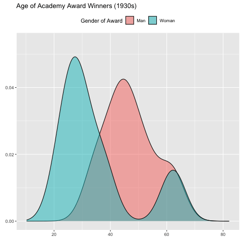

```{r}
#| label: set-up
#| include: false

library(tidyverse)
library(gganimate)
```

```{r}
#| label: ocars-data-clean
#| include: false

oscars <- read_csv(
  here::here("unit-1", 
             "data", 
             "oscars-demographics-DFE.csv")
  )

oscars <- oscars %>%
  select(-matches("^_")) %>%
  select(-contains("gold")) %>%
  select(-contains("confidence")) %>%
  separate(date_of_birth,
           into = c("Day", "Month", "Year"),
           sep = "-") %>%
  mutate(
    Year = as.numeric(Year),
    Year = case_when(
      Year < 100 ~ Year + 1900,
      TRUE ~ Year
    ),
    Birthdate = ymd(
      paste(Year, Month, Day)
      ),
    Date_of_award = ymd(
      paste(year_of_award, "Feb", "01")
      ),
    Age_at_Award = interval(Birthdate, Date_of_award) / years(1),
    Award_Gender = case_when(
      str_detect(award, "Actress") ~ "Woman",
      str_detect(award, "Actor") ~ "Man",
      TRUE ~ "Ungendered"
    ),
    Decade_of_Award = round(year_of_award, digits = -1)
  )

```

## gganimate

There are many, many ways to "spice up" your plots. We will focus in on one: 
making your plot animated! The best package for this, if you are using `ggplot`
already, is `gganimate`.

::: callout-note
`gganimate` plot objects can sometimes take a long time to render. One way to
make it quicker is to change the number of frames in your gif. Another trick is
to use the [cache chunk option](https://quarto.org/docs/computations/r.html#caching) 
in Quarto, so that you don't re-render the images every time you knit your file.
:::

::: {.callout-required-reading}
[Getting Started with `gganimate` (from the `gganimate` Documentation)](https://gganimate.com/articles/gganimate.html)
:::

::: {.callout-learn-more}
[How to Create Plots with Beautiful Animation (Datanovia Blog Post) ](https://www.datanovia.com/en/blog/gganimate-how-to-create-plots-with-beautiful-animation-in-r/)

Or you could watch [Thomas Lin Pedersen's](https://www.data-imaginist.com/about)
Posit Conf 2019 talk on `gganimate`:

::: youtube-video-container

:::
:::

::: {.callout-check-in}

1.  Fill in the five (5) blanks for the `gganimate` plot below:

```{r}
#| label: gganimate-plot-code-trans-states
#| include: false
#| eval: false

p1 <- oscars %>%
  filter(Award_Gender != "Ungendered") %>%
  ggplot(aes(y = Age_at_Award, x = award, fill = Award_Gender)) +
  geom_boxplot() +
  ggtitle("Age of Academy Award Winners ({closest_state})") + 
  xlab("Year of Award") +
  ylab("Age at Award") +
  transition_states(Award_Gender) +
  shadow_mark(alpha = 0.3)

animate(p1, nframes = 10, fps = 5)
```

```{r}
#| label: gganimate-transition-time
#| eval: false
#| echo: false

p2 <- oscars %>%
  filter(Award_Gender != "Ungendered") %>%
  ggplot(aes(x = Age_at_Award, fill = Award_Gender)) +
  geom_density(alpha = 0.5) +
  labs(title = "Age of Academy Award Winners ({frame_time}s)", 
       x = "", 
       y = "", 
       fill = "Gender of Award") +
  theme(legend.position = "top") +
  transition_time(Decade_of_Award)

animate(p2, nframes = 9, fps = 1)

anim_save(filename = "oscars-animation.gif")
```

```{r}
#| eval: false
#| label: gganimate-code
#| echo: true

___ <- oscars %>%
  filter(Award_Gender != "Ungendered") %>%
  ggplot(aes(x = Age_at_Award, fill = Award_Gender)) +
  geom_density(alpha = 0.5) +
  labs(title = "Age of Academy Award Winners ({____}s)", 
       x = "", 
       y = "", 
       fill = "Gender of Award") +
  theme(legend.position = "top") +
  ____(Decade_of_Award)

animate(p2, nframes = ____, fps = ____)
```



:::

## Other Extensions

Although we don't have time to go in-depth on every single extension of
`ggplot`, there are **so** many wonderful ways to up your Data Viz game.

Take a look around the links below!

::: {.callout-required-reading}
[`ggplot` Extension Gallery](https://exts.ggplot2.tidyverse.org/gallery/)
:::

::: {.callout-check-in}

2.  Which extension package would you use to...

*Hint: There is more than one possible answer for each question!*

a)  Visualize a **social network** using twitter data?

<!-- ggraph, ggnetwork -->

b)  **Add p-values** to your side-by-side boxplot of treatment groups, showing
the significance of the differences?

<!-- ggpubr, ggstatsplot -->

c)  Arrange **several different plots** next to each other?

<!-- patchwork, cowplot, GGAlly -->

d)  Make it so **hovering over a point** in your scatterplot shows the
corresponding label?

<!-- plotly, ggraph -->
:::

::: {.callout-learn-more}
-   [The "dataisbeautiful" subreddit](https://www.reddit.com/r/dataisbeautiful/top/?t=all) shares many nice visualizations. 
-   Don't forget about the [Data-to-Viz Website](https://www.data-to-viz.com/)
<!-- -   [This webinar](https://www.youtube.com/watch?v=0m4yywqNPVY), by ggplot contributor Thomas Lin Pedersen, is wonderful. It's about 2 hours long - so more than we can fit in as required viewing - but if you want to become a `ggplot` queen, watch this! -->
<!-- -   Dave Robinson's [Tidy Tuesday Screencasts](https://www.youtube.com/user/safe4democracy/videos) show a Picasso of Data Viz at work! -->
:::
