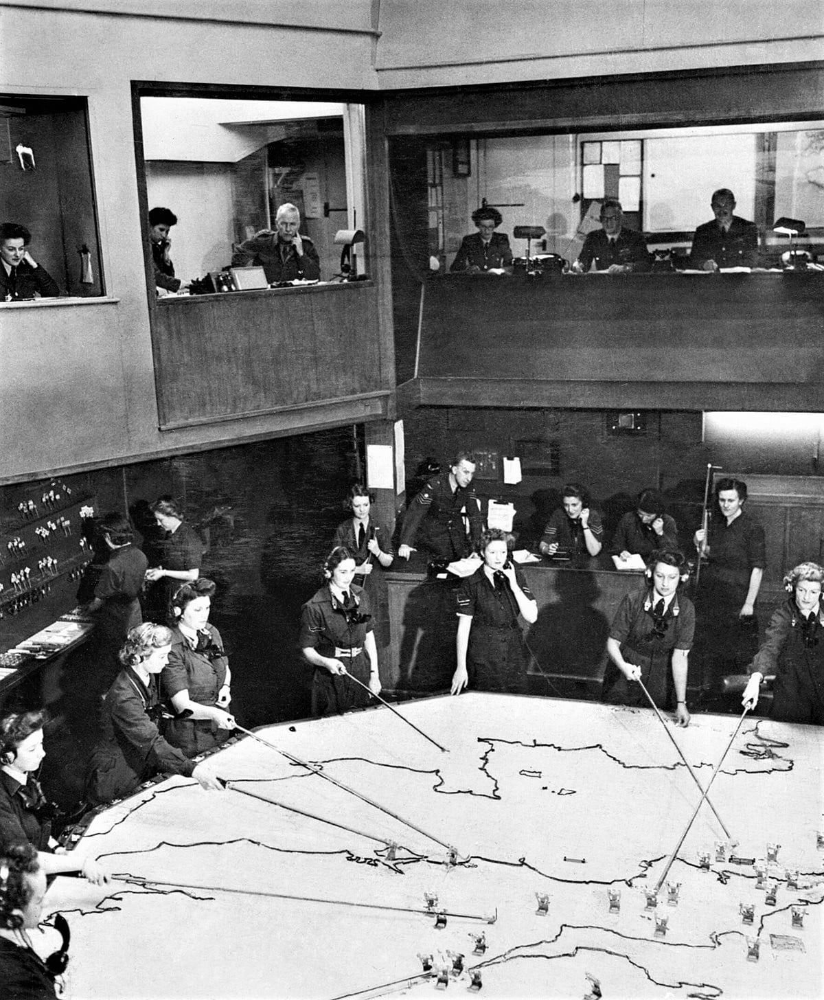

This week, we're taking the visualization skills we learned last week and using
them to create an informational dashboard. Quarto dashboards were integrated
into version 1.4, so you can use a familiar tool to create these dashboards. 
In Part 1, we will focus on creating "static" dashboards---where the user 
**does not** interact with the content. 

## Step 1 - What is a Quarto dashboard?

::: {.callout-required-video}
::: youtube-video-container


:::

</br>

- Slides for this Video: <https://mine.quarto.pub/quarto-dashboards/1-hello-dashboards/>
- Starter Documents: <https://github.com/mine-cetinkaya-rundel/olympicdash/blob/main/olympicdash-r-1.qmd>
:::

::: {.callout-check-in}
1. To make a Quarto dashboard what do you put in the `format` line of your YAML?

2. If you use the default options for a Quarto dashboard and your code makes 
two plots, how will they be output?

- Stacked horizontally (side-by-side)
- Stacked vertically

3. How would you define a card title in an R code chunk?
:::


## Step 2 - How do you make a Quarto dashboard?

::: {.callout-required-video}
::: youtube-video-container


:::

</br>

- Slides for this Video: <https://mine.quarto.pub/quarto-dashboards/2-dashboard-components/>
- Starter Documents: <https://github.com/mine-cetinkaya-rundel/olympicdash/blob/main/olympicdash-r-2.qmd>
:::

::: {.callout-check-in}
4. In a Quarto dashboard what does a `#` create?

- A new column
- A new row
- A new page

Suppose your Quarto dashboard has a YAML that looks something like this:

<!-- ``` {.markdown filename="my-first-dash.qmd" style="overflow-y: hidden"} -->

```{.yaml}
---
title: "Olympic Games"
format: 
  dashboard:
    orientation: columns
---
```

5. With this YAML, what does a `##` create?

- A new column
- A new row
- A new page

6. What does a `###` create? 

- A new column
- A new row
- A new page

7. How do you change the size of a row? Of a column?

<!-- row: {height="70%"} -->
<!-- column: {width="70%"} -->

8. Can different pages of a Quarto dashboard use different orientations?
Meaning, can one page use a row orientation and another page use a column 
orientation?

9. Which of the following cells will become a card in a dashboard?

::: columns
::: {.column width="48%"}

a. 

```{r}
#| echo: fenced
x <- 2
```

b. 

```{r}
#| echo: fenced
plot(cars)
```

:::

::: {.column width="2%"}
:::

::: {.column width="48%"}
c. 

```{r}
#| echo: fenced
#| output: false

2 + 2
```

d. 

```{r}
#| echo: fenced
library(palmerpenguins)
```

:::
:::

10. How do you create a card outside of an R script? Meaning, how would you 
create a card in Quarto?

<!-- ::: {.card} -->
:::

## History of Dashboards

{fig-alt="The Operations Room at RAF Fighter Command's No. 10 Group Headquarters, Rudloe Manor (RAF Box), Wiltshire, showing WAAF plotters and duty officers at work, 1943. General view of the Operations Room at No. 10 Group Headquarters, Rudloe Manor (RAF Box), Wiltshire, showing WAAF plotters and duty officers at work."}

The dashboard has arguably become prolific in data science. Indeed we have heard
from many of our own students that once their employer learns that they can 
create dashboards, this often becomes part of their job or helps them land a 
job. While dashboards are a great tool for ingesting information, they are not
without their faults. 

[This article by Shannon Mattern](https://placesjournal.org/article/mission-control-a-history-of-the-urban-dashboard/) provides an excellent history on the use of dashboards, dating 
all the way back to early 1900s. 

::: {.callout-note}
If you have the time, this entire article is quite interesting. However, 
if you are a bit short on time this week, we would strongly encourage you read
the final section---"Critical Mud: Structuring and Sanitizing the Dashboard."
:::


# Additional Resources

::: {.callout-learn-more} 

- [Quarto Dashboard Gallery](https://quarto.org/docs/gallery/#dashboards) - Example dashboards from the community of Quarto users
- [Quarto Dashboard Tutorial](https://quarto.org/docs/dashboards/) - Simple starting guide
- [Quarto Dashboard Reference](https://quarto.org/docs/reference/formats/dashboard.html) - Reference to all functions / aspects of a Quarto dashboards
:::
