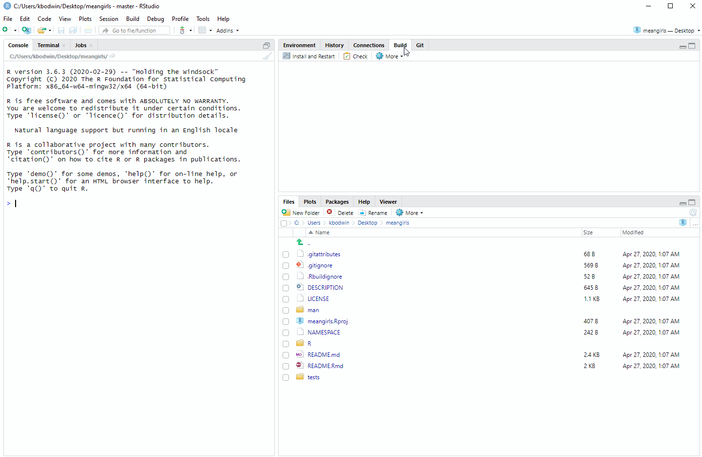
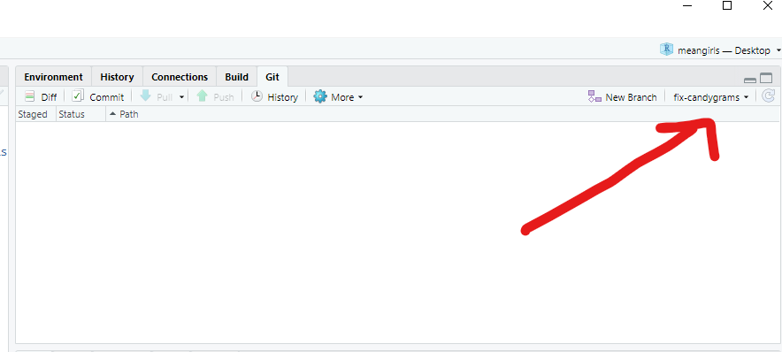
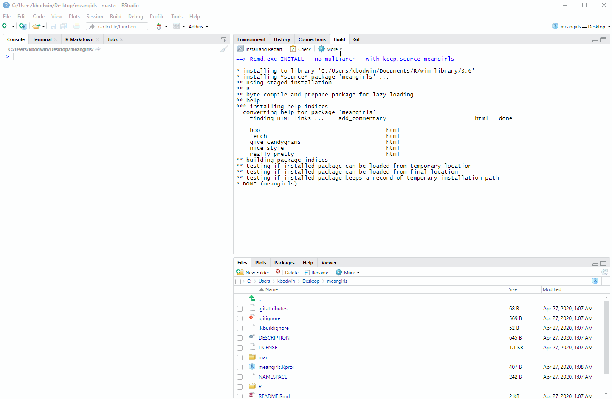
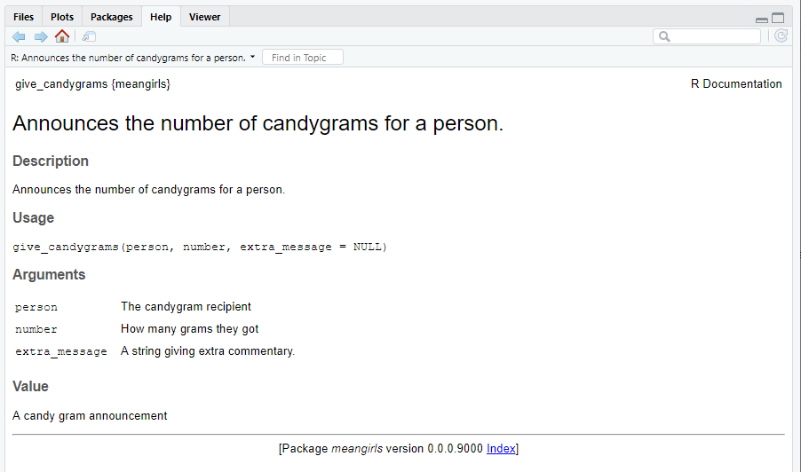
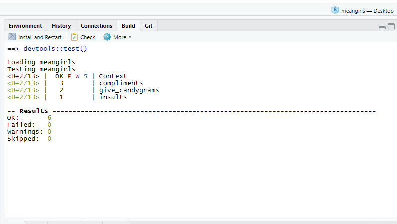

## Basics of Packages

In principle, an R Package is nothing more than a folder with a very specific structure, 
which allows R to recognize it as a "Package".  Minimally, to be a package, a folder
must contain:

1. A subfolder named `/R/`, containing `.R` code files.
2. A text file named `DESCRIPTION`, which contains information about the package 
in a *very* specifically formatted way.
3. A text file named `NAMESPACE`, which contains a list of the functions that 
the package makes available.

If you're thinking to yourself, *"Boy, that sounds like a lot of annoyingly specific
formatting!"* - you're not wrong.  Fortunately, there are automatic ways to make 
these files, which we will learn about soon!

Any folder with that structure can, in principle, be **installed** into R as a
package.  Typically, you will be installing packages from one of three sources:

#### 1. `install.packages("something")`

If you are able to install a package directly using `install.packages()`, that
means the package has been accepted to the [Comprehensive R Archive Network](https://cran.r-project.org/),
or **CRAN**.  

The minimal folder structure is not sufficient to be accepted to CRAN; these 
packages must meet many strict guidelines about documenting and testing the package's functions.

#### 2. `remotes::install_github("username/something")`

You may have come across packages you wanted to use that could only be installed
using the `install_github` function (from the `remotes` package).

In principle, anyone can put a package-structured folder on GitHub, and if the repository
is public, anyone else can install that package.

In practice, it's good to have your package meet CRAN-like levels of careful 
documentation before you share it with the public.


#### 3. Installing from your personal sources

If you use R heavily in the future, you may find it useful to write packages
just for yourself.  For example, if you find yourself using the same small "helper"
functions over and over, it can be nice to simply load a package rather than re-run
them for every project.

We won't worry about installing from sources for this class.

::: callout-important
# Check-In: Package Structure

Visit [this GitHub repository](https://github.com/Cal-Poly-Advanced-R/meangirls), where our good friend Regina George has made a package.

Answer the following questions about Regina's package by clicking around in her files.

1. What is the name of this package?
2. Besides Regina, who is listed as an author of this package?
3. Which other packages does Regina's package depend on?  (Hint: Which packages 
does this one *import*?)
4. Which functions are defined in the file `insults.R`?
5. In the documentation comments above the functions, what does `@param` indicate?
6. In the documentation comments above the functions, what does `@importFrom` do?
7. Look at the functions defined in the file `give_candygrams.R`.  One of them does 
NOT appear in the `NAMESPACE` file. What is different about the documentation comments
for this function?
8. Why do you think Regina decided not to include the function from Q7 in her namespace?

:::

## Contributing to Packages

Now let's help Regina make her `meangirls` package even better.

The `usethis` package will make this process easy and foolproof.  Make sure you have 
it installed now.

### Get set up

The first thing you need to do when you want to contribute to someone else's package
is to **fork** the package.  Recall that a **fork** is very different from a **clone**.  A *clone* simply copy-pastes the repository, while a *fork* retains its link to the original repository.

Now, we could go through the tedious process of *forking* the repository, then
all the steps after that to get it open in your local computer's RStudio.

Instead, let's do all these steps in one with `usethis`.  Open up a new RStudio
session, load the `usethis` package, and then run:

```{r, eval = FALSE}
usethis::create_from_github("Cal-Poly-Advanced-R/meangirls")
```

A lot of output will print out.

Here's what this does:

* Forks the `meangirls` repo, owned by `Cal-Poly-Advanced-R` on GitHub, into your GitHub account.

* Clones your forked repo into a folder named "meangirls" on your desktop (or similar).

* Does additional git/GitHub setup:
    + Sets your *origin remote* (the repo you can push directly to) to be your 
    own forked copy of the "meangirls" repo.
    + Sets your *upstream remote* (the original version that you will later Pull Request)
    to be the "meangirls" repo owned by `Cal-Poly-Advanced-R`
    + Sets the *main branch* to be the original repo's main branch, so you can 
    pull future edits that Regina makes ("upstream changes") in the future.
    
* Opens a new instance of RStudio in the `meangirls` R project. 


It is also possible to do this steps without `usethis::create_from_github`, if you prefer.

1. On GitHub, navigate to [the package repo](https://github.com/Cal-Poly-Advanced-R/meangirls)
and click "Fork".

2. Using GitHub Desktop (or your preferred method), clone your new forked package
to your local machine.

3. Navigate to the folder where you cloned the package, and open the `.Rproj`.


### Make some simple changes

We are now ready to get our hands dirty with this package.

First, **build the package**.  You can do this by typing `Cmd/Ctrl-Shift-B`, or by clicking in the "Build" pane:



Open up **README.Rmd** and knit it. Scroll to the very bottom.  Do you see a problem with the output?

It's time to fix the `give_candygrams()` function so that it includes extra
messages. But first, we need to make a **branch** of our repo, so that when we change the code,
it is carefully tracked separately.

In your console, type:

```{r, eval = FALSE}
usethis::pr_init("fix-candygrams")
```

This will switch you to a new branch.




Now, we can finally edit the source code.

Fix the code in `give_candygrams.R` so that the extra messages print out properly.
*(Hint: This is a small change in only one line of the code!)*

Check that the code is fixed by re-building the package, re-knitting the 
`README.Rmd` file, and looking at the output at the bottom.


When you are satisfied with your change, **commit your changes** to Git.

Then run in the console:

```{r, eval = FALSE}
usethis::pr_push()
```


This will magically pop up a Pull Request window! Complete the Pull Request if you wish.


### Testing the package

Last, let's check out the **unit tests** in Regina's package.

In any package, it's very important to write automatic tests to check that your
functions work the way you hope.  As the package gets more complex, you can then
keep running your tests to make sure nothing broke along the way.

Run the tests that Regina has written for her package by typing `Ctrl/Cmd-Shift-T`; 
or from the drop-down menu in the Build pane:




Oh no!  One of the unit tests failed.

In the folder `tests/testthat`, find the appropriate test file.  Figure out how
the actual output was different from the expected output.

Start a new pull request branch using `usethis::pr_init()`, as you did above. Track down the error, and make changes to the function.  Keep trying until alltests succeed.


### Make a major contribution

When handing out candygrams, [Santa has a whole classroom of students to announce](https://www.youtube.com/embed/nnjWmz4lB2U).


It would be tedious to have to call the `give_candygrams()` function once for
each student.  Instead, it would be convenient to have a vector of student names
and a vector of candygram counts, and run a single function like so:

```{r, eval = FALSE}

students <- c("Taylor Zimmerman", "Glen Coco", "Cady Heron", "Gretchen Weiners")
counts <- c(2, 4, 1, 0)


give_many_candygrams(students, counts)
```


1. Write the function `give_many_candygrams()` into the `meangirls` package.  

2. Do your best to copy the documentation style of the `give_candygrams()` function.
Type `Ctrl-Shift-D`, or use the Build pane drop-down menu, to automatically write
a documentation file for your function.

3. Re-build the package.  Then type `?give_many_candygrams` in your console.

4. Look at the "Help" pane that pops up.  It should look like this, 
except with the documentation for your new `give_many_candygrams` function:



Type in your console:

```{r, eval = FALSE}
use_test("give_many_candygrams")
```


Edit the file that pops up, to create a unit test for your new `give_many_candygrams` 
function. Re-run the tests for the package.  It should look like this, but with a total of 7 tests:



::: callout-important
# Check-In: Contributing to a Package

1. Which line would NOT be correct in the documentation for `give_many_candygrams`?

a. `@param person The candygram recipient.`
b. `@param number How many grams they got.`
c. `@param extra_message A string giving extra commentary.`
d. `@param Value A candy gram announcement.`


2. Consider the following unit test for `give_many_candygrams`:

```{r}
#| eval: false


```

What would you expect to happen for this test?

a. It would pass because
b. It would pass because
c. It would fail because
d. It would fail because

:::


## Package Creation From Scratch

::: {.callout-required-reading}
[R Packages Chapter 1 - The Whole Game](https://r-pkgs.org/whole-game.html)

*You may want to follow along yourself with the steps in this chapter - it will give you a head start on the Practice Activity this week!*
:::


::: callout-important
# Check-In: Package Workflow

1. Match the following helper packages to their usage in package creation.


::: columns
::: {.column width="20%"}
- `roxygen2`

- `testthat`

- `devtools`

- `usethis`

:::

::: {.column width="10%"}
:::

::: {.column width="70%"}
- Automatically creating and editing package files in the proper format.

- Loading, documenting, and running checks for the package after you make edits.

- Creating small *unit tests* for the functions in the package.

- Creating function documentation pages from comments in `.R` files.
:::
:::

2. In a `test_that` function, what is the difference between `expect_equal` and `expect_error`?

3. Which of the following files should you **never** open and edit by hand, instead of generating changes automatically during documentation or with a `usethis` function? *(Select all that apply.)*

a. `DESCRIPTION`
b. `NAMESPACE`
c. `README.Rmd`
d. Any `.R` source file in the `R/` folder.
e. Any `.md` documentation file in the `man/` folder
f. Any `test-*.R` file in the `tests/testthat/` folder

:::


